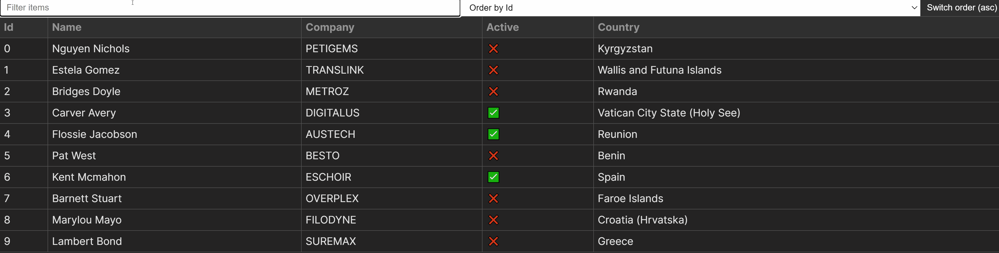

<h1 align="center">
    
</h1>
<h4 align="center">You can read the written tutorial about the implementation on <strong><a href="https://www.sitepoint.com/create-sortable-filterable-table-react/">SitePoint</a></strong> 📋</h4>
